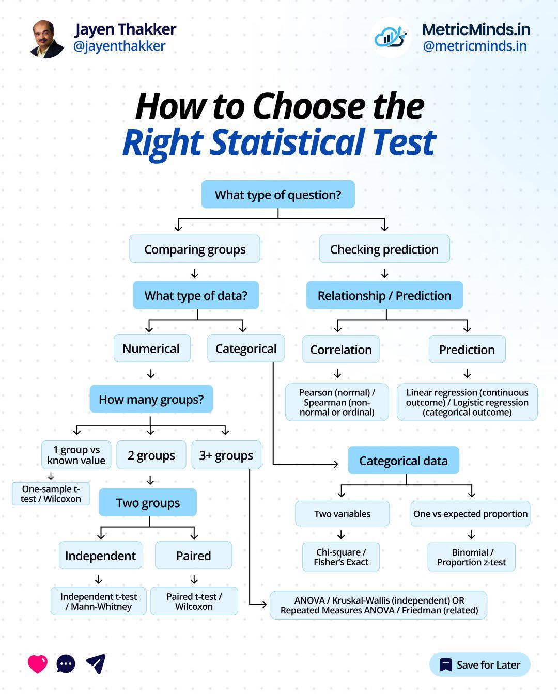

```{r setup, include=FALSE}
knitr::opts_chunk$set(echo = TRUE)
```

# Objectives:

1.  Explain the basic concepts of descriptive statistics and their
    importance in data analysis.
2.  Compute and interpret measures of central tendency, dispersion, and
    shape.
3.  Apply R functions to summarize, visualize, and describe datasets.
4.  Draw insights from statistical summaries to support decision-making.

# 1. Key Concepts

Statistics is the science of collecting, organizing, analyzing, and
interpreting data to make informed decisions. It has two major branches:

1.  **Descriptive Statistics:** Summarizes and describes data.
2.  **Inferential Statistics:** Draws conclusions about populations
    using samples.

| Term           | Definition               | Example                        |
|----------------|--------------------------|--------------------------------|
| **Population** | Entire group under study | All students in a university   |
| **Sample**     | Subset of the population | 100 randomly selected students |
| **Variable**   | Characteristic measured  | Age, height, weight            |
| **Data**       | Collected observations   | [18, 19, 20, 21]               |

Type of data and scales of measurement:

| Scale | Description | Example |
|------------------------|------------------------|------------------------|
| **Nominal** | Categories without order | Gender, Blood type |
| **Ordinal** | Ordered categories | Satisfaction level (High, Medium, Low) |
| **Interval** | Equal intervals, no true zero | Temperature (°C) |
| **Ratio** | Equal intervals with true zero | Weight, Height |

# 2. Descriptive Measures

## 2.1. Measures of Central Tendency

Describes the "center" of the data

| Measure    | Function in R   | Description         |
|------------|-----------------|---------------------|
| **Mean**   | `mean(x)`       | Arithmetic average  |
| **Median** | `median(x)`     | Middle value        |
| **Mode**   | Custom function | Most frequent value |

```{r cars}

# Create a vector containing a series of numbers
x <- c(5, 8, 10, 7, 5, 10)

```

```{r}

# Get the mean and median of x using mean() and median()

```

## 2.2. Measures of Dispersion (Variability)

Describe how spread out the data are

```{r}

# Get the range of x which is the difference between the max() and min()

```

```{r}

# Get the standard deviation, which is the spread of values around the mean,
# using sd()

```

```{r}

# Get the variance, which is the average squared deviation,
# using var()

```

```{r}

# Get the Interquartile Range (IQR), which indicates the spread of the middle 50% of the data, 
# using IQR()

```

## 2.3. Measures of Shape

Indicate how the data distribution looks

1.  Skewness = symmetry of distribution
2.  Kurtosis = peakedness or flatness

To demonstrate these, we will use the e1071 package, which is a populat
R library that provides a collection of functions for statistical and
machine learning methods

```{r}

# Install and load the package
install.packages("e1071", repos = "https://cloud.r-project.org")
library(e1071)

```

```{r}

# Check skewness
skewness(x)

# Skewness measures the asymmetry of the distribution, indicating whether the data 
# is leaning to the left (negative skew) or right (positive skew)

```

```{r}

# Check kurtosis
kurtosis(x)

# Kurtosis measures the "tailedness" or the peakedness of the distribution, 
# showing the degree to which the data is concentrated in the tails compared 
# to a normal distribution

```

Rule: Skewness \> 0 = right-skewed Skewness \< 0 = left-skewed Kurtosis
\> 3 = leptokurtic (peaked) Kurtosis \< 3 = platykurtic (flat)

# 3. Data Summarization and Visualization

Using the built-in data set on `PlantGrowth`

## 3.1. Getting the summary

```{r}

data("PlantGrowth")

# Get the summary
summary(PlantGrowth)

```

## 3.2. Basic visualization using base R plots

```{r}

# Histogram

hist(PlantGrowth$weight,           # column of plant growth to plot; choose weight
     main = "Histogram of Plant Weights",
     xlab = "Weight",
     col = "skyblue", border = "white")

```

```{r}

# Boxplot

boxplot(weight ~ group,         # make a boxplot of weight values for each group
        data = PlantGrowth,     # indicate the dataset
        main = "Boxplot of Plant Weights by Treatment",
        xlab = "Treatment Group", ylab = "Weight",
        col = c("lightgreen", "lightblue", "orange"))

```

# EXERCISE

Load the built-in dataset `mtcars`

1.  Compute the mean, median, and standard deviation of `mpg`
2.  Identify the range of the horsepower `hp`
3.  Which variable seems most variable? Use `summary()` and `sd()`

# 4. Sampling

Sampling is the process of selecting a portion (sample) from a larger
group (population) to make statistical inferences.

## 4.1 Why Sampling?

-   Reduces cost and time.\
-   Allows for analysis when it’s impractical to measure the entire
    population.\
-   Helps ensure data representativeness if done properly.

## 4.2 Types of Sampling Techniques

### **A. Probability Sampling**

Each member of the population has a known (non-zero) chance of being
selected.

| Method | Description | Example in R |
|------------------------|------------------------|------------------------|
| **Simple Random Sampling** | Every individual has an equal chance of selection. | `sample(x, size = n)` |
| **Systematic Sampling** | Select every *kth* element after a random start. | See example below |
| **Stratified Sampling** | Divide population into strata (groups), sample within each. | Using `dplyr::group_by()` and `sample_n()` |
| **Cluster Sampling** | Divide population into clusters and randomly select clusters. | Select groups of observations rather than individuals. |

Example: Simple Random Sampling

```{r}

# Simple Random Sampling

set.seed(123)       # tells R to start the random number generator at a specific point
                    # the same random numbers will be generated every time the code is run

population <- 1:100
sample(population, size = 10)  # takes a sample of the specified size

```

Example: Systematic Sampling

```{r}

# Set the sampling interval
k <- 5

# Randomly choose the starting point between 1 and k
start <- sample(1:k, 1)

# Generate a sequence starting at the chosen random start point and increase by k
# until reaching 100
sys_sample <- seq(start, 100, by = k)

# Output
sys_sample

```

Example: Stratified Sampling

```{r}

# Create a data frame
population <- data.frame(ID = 1:100,  # Create a column named ID with numbers 1-100
                         Group = rep(c("A", "B"), each = 50)) # rep() = repeat, each 50 times

# Divide the population into subsets based on Group
# For each group, take 5 random rows then bind them in a single data frame
sample_strat <- do.call(rbind, lapply(split(population, population$Group),
                                      function(x) x[sample(1:nrow(x), 5), ]))
sample_strat

```

Example: Cluster Sampling

```{r}

# Create the population data set
population <- data.frame(ID = 1:100, # Assigns IDs from 1 to 1000
                         Cluster = rep(1:10, each = 10))  # repeats each cluster number 10 times

# Randomly select clusters
selected_clusters <- sample(1:10, # All possible cluster numbers
                            2)    # randomly select 2 clusters from 10

# Extract individuals belonging to those clusters
sample_cluster <- subset(population, 
                         Cluster %in% selected_clusters) # Keep only rows whose 
                                                        # Cluster value is in the selected list
# Output
sample_cluster


```

### **B. Non-Probability Sampling**

Selection depends on researcher judgment or convenience, not
randomization

1.  Convenience sampling = easily available participants
2.  Purposive sampling = based on specific characteristics
3.  Quota sampling = ensures certain groups are represented in set
    proportions
4.  Snowball sampling = existing participants recruit future
    participants


