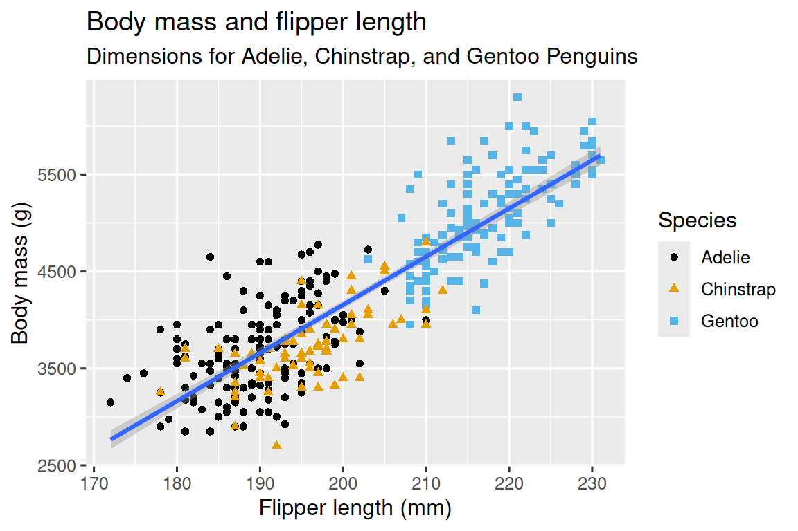

```{r setup, include=FALSE}
knitr::opts_chunk$set(echo = TRUE)
```

**Tidyverse is a collection of R packages designed for data
manipulation, visualization, and analysis.**

It provides a cohesive suite of packages with a consistent, readable
syntax that makes data manipulation, visualization, and analysis more
intuitive and efficient.

**Key benefits:**

-   streamlined workflow using the pipe operator,
-   special tools for data wrangling and reshaping, and
-   the use of tibbles, a modern version of R's data tables.

The tidyverse simplifies common data science tasks and is designed to be
easier to learn and use for both beginners and experienced data
scientists.

**Key packages:**

| Package   | Purpose                |
|-----------|------------------------|
| readr     | Reading data           |
| tibble    | Enhanced data frames   |
| dplyr     | Data manipulation      |
| tidyr     | Reshaping data         |
| stringr   | String operations      |
| forcats   | Factor manipulation    |
| lubridate | Date-time manipulation |
| ggplot2   | Data visualization     |
| purrr     | Functional programming |

Tidy data means each variable is a column, each observation is a row,
and each type of observational unit forms a table.

Main reference: <https://tidyverse.org/packages/>

# Installation

Note: Again, it is not recommended to install packages inside an R
Markdown. We can do this in the console or in a separate .R script
inside this R Project.

```{r, eval = FALSE}

# Type this code in the console or "uncomment" (i.e., remove hashtag) the line
# install.packages("tidyverse")

```

```{r}

# Load the tidyverse package
library(tidyverse)

# We will also use the here package
library(here)

```

# 1. `readr`

readr provides a fast and friendly way to read rectangular data (like
csv, tsv, and fwf). It is designed to flexibly parse many types of data
found in the wild, while still cleanly failing when data unexpectedly
changes.

readr supports the following file formats with these read\_\*()
functions:

-   `read_csv()`: comma-separated values (CSV)
-   `read_tsv()`: tab-separated values (TSV)
-   `read_csv2()`: semicolon-separated values with , as the decimal mark
-   `read_delim()`: delimited files (CSV and TSV are important special
    cases)
-   `read_fwf()`: fixed-width files
-   `read_table()`: whitespace-separated files
-   `read_log()`: web log files

**Example 1: Read in a .csv data from the its website**

```{r}

data <- read_csv("https://raw.githubusercontent.com/uiuc-cse/data-fa14/gh-pages/data/iris.csv")

```

**What's the point of using `read_csv()` when I already learned how to
use `read.csv()`?**

| Feature | `read.csv()` | `read_csv()` |
|--------------------|--------------------------|--------------------------|
| **Syntax style** | Base R syntax | Tidyverse syntax (modern, faster, and cleaner) |
| **Returns** | A **data frame** | A **tibble** (a modern version of data frame) |
| **Reads faster?** | Slower (especially on large files) | Much faster (C++ backend) |
| **Strings are treated as...** | Converted to **factors** by default (`stringsAsFactors = TRUE` in older R versions) | Kept as **character** (never auto-converts to factor) |
| **Column type guessing** | Basic, sometimes incorrect | More intelligent, infers numeric, date, etc. |

**When we say read_csv() (from the readr package) is faster because it
uses a C++ backend, it means:**

The core code that actually reads and parses the CSV file is written in
the C++ programming language, not pure R.

**Why does that matter?**

**R is an interpreted language:** it is easier to use but slower for
heavy computations.

**C++ is a compiled language:** it runs much faster because it executes
machine code directly.

**What is a "compiled language"?**

It is where the code we write is translated into machine code first (the
1s and 0s that your computer’s processor actually understands) before
the program runs.

*That's not what R does?*

Nope. In R, each line is translated into machine instructions while
running, thus, making the process slower (although not really noticeable
when datasets are not VERY large and the computing power of the machine
we use is sufficient.)

**Example 2: Read in a sample file bundled with the readr package**

```{r}

chickens <- read_csv(readr_example("chickens.csv"))

```

Note that readr prints the column types *– the guessed column types*, in
this case. This is useful because it allows us to check that the columns
have been read in as we expect.

```{r}

# Use spec() to retrieve the column specification
spec(chickens)

```

Now we can copy, paste, and tweak this, to create a more explicit readr
call that expresses the desired column types.

```{r}

chickens <- read_csv(
  readr_example("chickens.csv"),
  col_types = cols(
    chicken   = col_character(),
    sex       = col_factor(levels = c("rooster", "hen")), # set to be a factor with levels rooster and hen
    eggs_laid = col_integer(),         # set as integer
    motto     = col_character()
  )
)

chickens

```

To see the expanded introduction/documentation:

```{r}

vignette("readr")

```

### **EXERCISE:** Using `read_csv()`, re-import the "Syr_MetData.csv" data that we used in the previous exercise.

Assign it to an R object named "weather_2"

```{r}


```

Compare "weather" and "weather_2".

```{r}

head(weather)

```

```{r}

head(weather_2)

```

In R:

Integers (int) are stored exactly (no fractions, therefore, smaller
memory footprint)

Doubles (dbl) are stored as floating-point numbers (can represent
decimals)

# 2. `tibble`

<https://tibble.tidyverse.org/>:

A tibble, or `tbl_df`, is a modern reimagining of the data.frame,
keeping what time has proven to be effective, and throwing out what is
not.

**Tibbles are data.frames that are lazy and surly:** they do less (i.e.
they don’t change variable names or types, and don’t do partial
matching) and complain more (e.g. when a variable does not exist).

This forces you to confront problems earlier, typically leading to
cleaner, more expressive code.

Tibbles also have an enhanced `print()` method which makes them easier
to use with large datasets containing complex objects.

```{r}

vignette("tibble")

```

1.  **Creating a tibble**

`tibble()` creates a **tidy** table, which automatically handles column
types **and prints nicely.**

```{r}

# Create a simple tibble

my_tibble <- tibble(
  Name = c("Alice", "Bob", "Charlie"),
  Age = c(25, 30, 35),
  Score = c(90, 85, 88)
)

my_tibble

```

2.  **Converting a data.frame to tibble**

```{r}

# Use built-in mtcars dataset

mtcars_tbl <- as_tibble(mtcars)

mtcars_tbl

```

`as_tibble()` converts data frame to tibble **for better readability and
tidyverse compatibility**.

Row names are not printed as a column automatically (unlike data frame).

### EXERCISE: Try converting the `inventory` data frame from the previous into a tibble:

```{r}


```

3.  **Adding row names as a column.**

```{r}

# Note that we can use %>% , the pipe operator, to chain functions.

mtcars_tbl <- mtcars_tbl %>%
  rownames_to_column(var = "Car")  # var = name of column to use for rownames

head(mtcars_tbl)

```

4.  **Accessing columns and subsetting**

```{r}

# Access single column
mtcars_tbl$mpg

```

```{r}

# Use tibble subsetting (returns tibble, not vector)
mtcars_tbl[1:5, c("Car", "mpg")]

```

Note that using \$ returns a vector while subsetting with [ ] keeps
tibble structure.

# 3. `dplyr`

`dplyr` is a grammar of data manipulation, providing a consistent set of
verbs that help us solve the most common data manipulation challenges:

-   `mutate()` adds new variables that are functions of existing
    variables
-   `select()` picks variables based on their names.
-   `filter()` picks cases based on their values.
-   `summarise()` reduces multiple values down to a single summary.
-   `arrange()` changes the ordering of the rows.

These all combine naturally with group_by() which allows us to perform
any operation “by group”.

Note that we can use `%>%` – the pipe operator - to chain functions.

Recall: Keyboard shortcut: - Windows = Ctrl + Shift + M - Mac = Cmd +
Shift + M

```{r}

vignette("dplyr")

```

The best place to start learning dplyr is through the data
transformation chapter in the "R for Data Science" book:
[**https://r4ds.hadley.nz/data-transform**](https://r4ds.hadley.nz/data-transform){.uri}

**Note: The next sections are lifted/modified based on this reference.**

To explore basic `dplyr` ***verbs***, we will use the
`nycflights13::flights` dataset. This dataset contains all 336,776
flights that departed from New York City in 2013. The data comes from
the US Bureau of Transportation Statistics and is documented in
`?flights`

```{r}

# Install the package then load it
# install.packages("nycflights13")

library(nycflights13)

```

```{r}

# Explore the data set

View(flights)
flights

```

```{r}

# Check the documentation
?flights

```

`flights` is a tibble, a special type of data frame used by the
tidyverse

The most important difference between tibbles and data frames is the way
tibbles print; they are designed for large datasets, so they only show
the first few rows and only the columns that fit on one screen.

```{r}

# dplyr function to view the data
glimpse(flights)

```

The variable names are followed by abbreviations that tell us the type
of each variable: `<int>` is short for integer `<dbl>` is short for
double (aka real numbers) `<chr>` for character (aka strings), and
`<dttm>` for date-time

These are important because the operations we can perform on a column
depend heavily on its “type.”

## 3.1. `dplyr` basics

1.  The first argument is always a data frame.

2.  The subsequent arguments typically describe which columns to operate
    on using the variable names (without quotes).

3.  The output is always a new data frame.

```{r}

flights |>                    # another form of %>% pipe operator
  filter(dest == "IAH") |> 
  group_by(year, month, day) |> 
  summarize(
    arr_delay = mean(arr_delay, na.rm = TRUE)
  )

```

**dplyr’s verbs are organized into four groups based on what they
operate on: rows, columns, groups, or tables.**

## 3.2. Row operations

### a. `filter()`

`filter()` allows us to keep rows based on the values of the columns

```{r}

# Filter for flights that departed more than 120 minutes (2 hours) late:

flights %>% 
  filter(dep_delay > 120)

```

```{r}

# Filter for flights that departed on January 1
flights %>% 
  filter(month == 1 & day == 1)

```

```{r}

# Filter for flights that departed in January or February
flights %>% 
  filter(month == 1 | month == 2)

```

```{r}

# Combine OR (|) and equal to (==)

flights %>% 
  filter(month %in% c(1, 2))  # %in% instead of using | and ==

```

When we run `filter()` `dplyr` executes the filtering operation,
creating a new data frame, and then prints it.

It doesn’t modify the existing flights dataset because `dplyr` functions
never modify their inputs. To save the result, we need to use the
assignment operator, `<-`

```{r}

jan1 <- flights %>% 
  filter(month == 1 & day == 1)

jan1
```

### EXERCISE: Using the `weather` data that we used in the previous exercise, filter for:

1.  data that were recorded in year 1997

```{r}
 
```

2.  data that were recorded from year 1940 to 2000

```{r}

```

3.  days that had precipitation and the maximum temperature is greater
    than 30 F

```{r}

```

### b. `arrange()`

arrange() changes the order of the rows based on the value of the
columns. It takes a data frame and a set of column names (or more
complicated expressions) to order by.

```{r}

# Sort the departure time by year, month, day, and departure time
flights %>% 
  arrange(year, month, day, dep_time)

```

We get the earliest years first, then within a year, the earliest
months, etc.

```{r}

# Arrange the flights from most to least delayed
flights %>% 
  arrange(desc(dep_delay))  # use desc()

```

Note that the number of rows has not changed – we’re only arranging the
data, we’re not filtering it.

### EXERCISE: `weather` data

1.  Arrange the data based on precipitation (from highest to lowest)

```{r}


```

### c. `distinct()`

distinct() finds all the unique rows in a dataset, so technically, it
primarily operates on the rows.

Most of the time, however, we’ll want the distinct combination of some
variables, so we can also optionally supply column name.

```{r}

# Remove duplicate rows, if any
flights %>% 
  distinct()

```

```{r}

# Find all unique origin and destination pairs

flights %>% 
  distinct(origin, dest)

```

```{r}

# Keep all other columns when filtering for unique rows
flights %>% 
  distinct(origin, dest, .keep_all = TRUE)

```

```{r}

# Find the number of occurences
# Swap distinct() with count()

flights %>% 
  count(origin, dest, sort = TRUE)

```

### EXERCISE: Find how many distinct years there are in the `weather` and how many occurrences there are of each year.

```{r}
  
```

## 3.3. Column operations

### a. `mutate()`

The job of `mutate()` is to add new columns that are calculated from the
existing columns.

```{r}

# Add a column which computes the `gain` (how much time a delayed flight made up in the air)
# and `speed` in miles per hour

flights %>% 
  mutate(
    gain = dep_delay - arr_delay,      # computes the gain
    speed = distance / air_time * 60  # computes the speed
  )
```

By default, `mutate()` adds new columns on the right-hand side of our
dataset, which makes it difficult to see what’s happening here. We can
use the `.before` argument to instead add the variables to the left-hand
side.

```{r}

flights %>% 
  mutate(
    gain = dep_delay - arr_delay,
    speed = distance / air_time * 60,
    .before = 1
  )

```

The `.` indicates that `.before` is an argument to the function, not the
name of a third new variable we are creating.

We can also use `.after` to add after a variable, and in both `.before`
and `.after` we can use the variable name instead of a position.

```{r}

flights %>% 
  mutate(
    gain = dep_delay - arr_delay,
    speed = distance / air_time * 60,
    .after = day
  )

```

Alternatively, we can control which variables are kept with the `.keep`
argument. A particularly useful argument is "used" which specifies that
we only keep the columns that were involved or created in the `mutate()`
step.

```{r}

flights %>% 
  mutate(
    gain = dep_delay - arr_delay,
    hours = air_time / 60,
    gain_per_hour = gain / hours,
    .keep = "used"
  )

```

### EXERCISE: Create new columns in `weather` which converts the precipitation from inches to centimeters and another for the average of TMAX and TMIN.

```{r}

  
```

### b. `select()`

select() allows us to rapidly zoom in on a useful subset using
operations based on the names of the variables

```{r}

# Select columns by name

flights %>% 
  select(year, month, day)

```

```{r}

# Select all columns between year and day

flights %>% 
  select(year:day)

```

```{r}

# Select all columns except those from year to day (inclusive)
flights %>% 
  select(!year:day)

```

```{r}

# Select all columns that are characters

flights |> 
  select(where(is.character))

```

There are a number of helper functions we can use within select():

-   `starts_with("abc")`: matches names that begin with “abc”.
-   `ends_with("xyz")`: matches names that end with “xyz”.
-   `contains("ijk")`: matches names that contain “ijk”.
-   `num_range("x", 1:3)`: matches x1, x2 and x3.

See `?select` for more details.

```{r}

?select

```

We can rename variables as we `select()` them by using `=`. The new name
appears on the left-hand side of the `=`, and the old variable appears
on the right-hand side

```{r}

# Rename column tailnum to tail_num

flights %>% 
  select(tail_num = tailnum)

```

### EXERCISE: In the `weather` data, select the STATION, YEAR, PRCP, TMAX. At the same time, rename PRCP to precipitation and TMAX to max_temperature.

```{r}

```

### c. `rename()`

If we want to keep all the existing variables and just want to rename a
few, we can use `rename()` instead of `select()`

```{r}

flights %>% 
  rename(tail_num = tailnum)

```

### d. `relocate()`

Use `relocate()` to move variables around. By default, `relocate()`
moves variables to the front.

```{r}

# Relocate time_hour and air_time to the front
flights %>%  
  relocate(time_hour, air_time)

```

We can also specify where to put them using the `.before` and `.after`
arguments

```{r}

flights %>% 
  relocate(year:dep_time, .after = time_hour)

flights %>% 
  relocate(starts_with("arr"), .before = dep_time)

```

### EXERCISE: Move the columns of PRCP and TMAX in the `weather` after the STATION column.

```{r}

```

## 3.4. Using the pipe

We've seen how the pipe operator works in many of the previous examples
but its real power arises when we start to combine multiple verbs

```{r}
# Find the fastest flights to Houston's IAH airport

flights %>% 
  filter(dest == "IAH") %>%  
  mutate(speed = distance / air_time * 60) %>% 
  select(year:day, dep_time, carrier, flight, speed) %>% 
  arrange(desc(speed))

```

For simple cases, \|\> and %\>% behave identically.

**\|\> is the base pipe. Why use it?**

1.  Because it is part of base R, it is always available for us to use,
    even when we’re not using the tidyverse (%\>% is from the magrittr
    package of tidyverse)

2.  \|\> is quite a bit simpler than %\>%

### EXERCISE: In the `weather` data,

1.  select the following columns: STATION, YEAR, PRCP, TMAX

2.  filter for data recorded from year 1990 onwards

3.  compute for precipitation in centimeters (PRCP_cm)

4.  arrange the data from highest to lowest precipitation

    Tip: Check the outputs step-by-step if we're getting what is
    expected.

```{r}

```

## 3.5. Groups

`dplyr` gets even more powerful when you add in the ability to work with
groups.

### a.1. `group_by()`

Use `group_by()` to divide the dataset into groups meaningful for your
analysis

```{r}

flights |> 
  group_by(month)

```

`group_by()` doesn’t change the data but, if we look closely at the
output, we’ll notice that the output indicates that it is “grouped by”
month (Groups: month [12]).

This means subsequent operations will now work “by month”.

### a.2. grouping by multiple variables

```{r}

daily <- flights |>  
  group_by(year, month, day)
daily

```

```{r}

daily_flights <- daily |> 
  summarize(n = n())

```

```{r}
daily_flights
```

We can suppress the message by:

daily_flights \<- daily \|\> summarize( n = n(), .groups = "drop_last" )

### b. `summarize()`

The most important grouped operation is a summary, which, if being used
to calculate a single summary statistic, reduces the data frame to have
a single row for each group.

In `dplyr`, this operation is performed by `summarize()`.

```{r}

flights |> 
  group_by(month) |> 
  summarize(
    avg_delay = mean(dep_delay)
  )

```

Results are **NA**s, R's symbol for missing value. This happened because
some of the observed flights had missing data in the delay column.

```{r}

# To ignore all missing values:

flights |> 
  group_by(month) |> 
  summarize(
    avg_delay = mean(dep_delay, na.rm = TRUE)
  )

```

```{r}

# Add the number of rows in each group

flights |> 
  group_by(month) |> 
  summarize(
    avg_delay = mean(dep_delay, na.rm = TRUE), 
    n = n()
  )
```

### EXERCISE: Group the `weather` data per year and then get the total precipitation and mean maximum temperature. Then, create a column that converts the mean precipitation in inches to millimeters.

```{r}

```

### c. `slice_()`

There are five handy functions that allow us to extract specific rows
within each group:

-   `df |> slice_head(n = 1)` takes the first row from each group.
-   `df |> slice_tail(n = 1)` takes the last row in each group.
-   `df |> slice_min(x, n = 1)` takes the row with the smallest value of
    column x.
-   `df |> slice_max(x, n = 1)` takes the row with the largest value of
    column x.
-   `df |> slice_sample(n = 1)` takes one random row.

```{r}

# Find the flights that are most delayed upon arrival at each destination

flights |> 
  group_by(dest) |> 
  slice_max(arr_delay, n = 1) |>
  relocate(dest)

```

Note that there are 105 destinations but we get 108 rows here. What’s
up? `slice_min()` and `slice_max()` keep tied values so `n = 1` means
give us all rows with the highest value.

If we want exactly one row per group you can set `with_ties = FALSE`.

This is similar to computing the max delay with `summarize()`, but we
get the whole corresponding row (or rows if there’s a tie) instead of
the single summary statistic.

### EXERCISE: Determine the day with the highest precipitation for every year in `weather` . Keep the YEAR and PRCP columns only so we can see results better.

```{r}

  
```

### d. `ungroup()`

For removing grouping from a data frame without using `summarize()`

```{r}

daily |>     # flights grouped by year, month, day
  ungroup()

```

```{r}

# Summarizing an ungrouped data frame

daily |> 
  ungroup() |>
  summarize(
    avg_delay = mean(dep_delay, na.rm = TRUE), 
    flights = n()
  )
```

Visit <https://r4ds.hadley.nz/data-transform.html> for more details and
examples.

# 4. `tidyr`

The goal of `tidyr` is to help you create tidy data. Tidy data is data
where:

1.  Each variable is a column; each column is a variable.
2.  Each observation is a row; each row is an observation.
3.  Each value is a cell; each cell is a single value.

Tidy data describes a standard way of storing data that is used wherever
possible throughout the tidyverse. If we ensure that your data is tidy,
we’ll spend less time fighting with the tools and more time working on
our analysis.

## 4.1. `pivot_longer()`

```{r}

# Use mtcars dataset
mtcars$id <- rownames(mtcars)  # add row names as a column
mtcars

```

```{r}

# Convert wide to long: mpg, hp, wt

mtcars_long <- mtcars %>%
  pivot_longer(cols = c(mpg, hp, wt),     # columns to pivot
               names_to = "Measurement",  # new column for variable names
               values_to = "Value")       # new column for values

head(mtcars_long)


```

## 4.2. `pivot_wider()`

```{r}

# Convert long mtcars back to wide format
mtcars_wide <- mtcars_long %>%
  pivot_wider(names_from = Measurement, # column containing variable names
              values_from = Value)      # column containing values

head(mtcars_wide)

```

## 4.3. `separate()`

```{r}

# Create example dataset
df <- tibble(Name = c("John_Doe", "Jane_Smith", "Alice_Jones"))
df

```

```{r}

# Separate full name into first and last names
df_sep <- df %>%
  separate(Name, into = c("First", "Last"), # new columns
           sep = "_")                       # character to split

df_sep

```

## 4.4. `unite()`

```{r}

# Unite first and last names back into one column
df_unite <- df_sep %>%
  unite("FullName",       # name of the new column
        First, Last,      # columns to combine
        sep = " ")        # separator to use

df_unite

```

## 4.3. `drop_na()` and `replace_na()`

```{r}

# Use the airquality dataset
head(airquality)

```

```{r}

# Drop rows with any NA
airquality_clean <- airquality %>%
  drop_na()       # removes rows with missing values

```

```{r}

# Replace NA in Ozone with 0
airquality_filled <- airquality %>%
  replace_na(list(Ozone = 0))        # replaces missing values with a specified value

head(airquality_clean)
head(airquality_filled)

```

### EXERCISE: Determine if there are any rows with NA in `weather`. If there are, drop these rows.

```{r}


```

# 5. `stringr`

Strings are not glamorous, high-profile components of R, but they do
play a big role in many data cleaning and preparation tasks.

The `stringr` package provides a cohesive set of functions designed to
make working with strings as easy as possible.

Learn more about strings: <https://r4ds.hadley.nz/strings>

## 5.1. `str_detect()`

Used for detecting patterns

```{r}

# Use rownames of mtcars as example
cars <- tibble(Car = rownames(mtcars))
cars

```

```{r}

# Detect cars containing "Mazda"
cars %>%
  mutate(Mazda = str_detect(Car,      # string
                            "Mazda")) # what to detect

# Returns TRUE if the pattern exists

```

## 5.2 `str_replace()` and `str_replace_all()`

```{r}

# Replace " " with "_" in car names
cars %>%
  mutate(Car_Underscore = str_replace_all(Car, " ", "_"))

# str_replace() replaces first match
# str_replace_all() replaces all matches

```

### EXERCISE: Replace all "SYRACUSE" in the NAME column of `weather` to "SYR"

```{r}


```

## 5.3. `str_extract()`

Extract parts of strings

```{r}

# Extract first word (make) from car name
cars %>%
  mutate(Make = str_extract(Car,           # str_extract extracts matching patterns
                            "^[^ ]+"))     # regex (regular expression) for first word (everything until first place)

```

## 5.4. `str_length()`, `str_trim()`

String length and trimming

```{r}

# Calculate length of car names
cars %>%
  mutate(
    Length = str_length(Car), # length of car name
    Trimmed = str_trim(Car)   # remove leading/trailing white space
  )

```

## 5.5. `str_c()`

Concatenating strings

```{r}

# Combine make with "Car" suffix
cars %>%
  mutate(CarLabel = str_c(Car, "-Car"))

```

### EXERCISE: Add "-SYR" to each STATION in `weather`

```{r}


```

## 5.6. `str_to_upper()`, `str_to_lower()`

Converting case

```{r}

cars %>%
  mutate(
    Upper = str_to_upper(Car),
    Lower = str_to_lower(Car)
  )

```

### EXERCISE: Convert NAME in `weather` to lower caps

```{r}


```

# 6. `forcats`

`forcats` provides a suite of useful tools that solve common problems
with factors. R uses factors to handle categorical variables, variables
that have a fixed and known set of possible values.

```{r}

# Convert cyl in mtcars to a factor
mtcars_tbl <- as_tibble(mtcars) %>%
  mutate(cyl_factor = factor(cyl)) # convert to categorical variable

# Check levels
levels(mtcars_tbl$cyl_factor)   # show the categories

```

## 6.1. `fct_reorder()`

Reordering factors

```{r}

# Reorder cyl_factor by mean mpg
mtcars_tbl <- mtcars_tbl %>%
  mutate(cyl_factor = fct_reorder(cyl_factor, mpg, mean))

# fct_reorder(f, x, fun = mean) orders factor levels based on a numeric variable.

# Check if reordered:
levels(mtcars_tbl$cyl_factor)

```

## 6.2. `fct_lump()`

Lump small categories

```{r}

# Create example factor
car_brands <- c("Ford", "Toyota", "Honda", "Mazda", "BMW", "Audi", "Ford", "Honda")
brand_factor <- factor(car_brands)

# Lump all but top 2 most common brands
fct_lump(brand_factor, n = 2) # fct_lump() combines small or rare levels into "Other"

```

## 6.3. `fct_relevel()`

Relevel factors

```{r}

# Make 6-cylinder first level
mtcars_tbl <- mtcars_tbl %>%
  mutate(cyl_factor = fct_relevel(cyl_factor, "6")) # fct_relevel() moves specified levels to the front

levels(mtcars_tbl$cyl_factor)

```

## 6.4. `fct_recode()`

Recoding factors

```{r}

# Rename levels
mtcars_tbl <- mtcars_tbl %>%
  mutate(cyl_factor = fct_recode(cyl_factor,   # fct_recode(f, new_name = old_name) renames factor levels
                                 "Six cylinders" = "6",
                                 "Four cylinders" = "4",
                                 "Eight cylinders" = "8"))

levels(mtcars_tbl$cyl_factor)

```

# 7. `lubridate`

Before diving in to `lubridate`, know that:

`as.Date()` is base R’s main function for converting text to date
objects.

```{r}

as.Date(x, format = , origin = )

```

Where:

x – a character vector, factor, or numeric value

format – tells R how to interpret the text (using % codes)

origin – required if x is numeric (the starting date)

**Example:**

```{r}

as.Date("2025-10-22")                 # ISO format recognized automatically

as.Date("10/22/2025", format = "%m/%d/%Y")
as.Date("22-10-2025", format = "%d-%m-%Y")

# %m = month
# %d = day
# %Y = 4-digit year
# %y = 2-digit year

```

| Code | Meaning                                       |
|------|-----------------------------------------------|
| `%Y` | 4-digit year (e.g., 1938)                     |
| `%y` | 2-digit year (00–99 → 2000–2068 or 1900–1999) |
| `%m` | Month (01–12)                                 |
| `%d` | Day (01–31)                                   |
| `%b` | Abbreviated month (e.g., "Jan")               |
| `%B` | Full month name (e.g., "January")             |

**VERY important to know:**

R represents dates and times internally as **the number of seconds (or
days) since "1970-01-01"**, known as the **Unix Epoch**.

**What is Unix Epoch?** It's **the reference point in time known as
midnight, Coordinated Universal Time (UTC), on Thursday, January 1,
1970**. It represents the starting point for the Unix time system, which
is used to measure time as the number of seconds that have elapsed since
this specific date.

Therefore, in R:

-   Dates **after 1970** = stored as positive numbers
-   Dates **before 1970** = stored as negative numbers

**Why 1970?**

This convention comes from early Unix systems (developed around 1970).\
Almost every programming language (Python, C, R, SQL, etc.) adopted it
for **consistency and interoperability**.

**Heads up: Because of this, we might run into problems when the dates
are earlier than January 1, 1970.**

**Example: From numeric days since origin**

```{r}

as.Date(0, origin = "1970-01-01")   # 1970-01-01
as.Date(-365, origin = "1970-01-01") # 1969-01-01

# Negative numbers mean pre-1970 dates
```

**Example: Handling pre-1970s**

```{r}

as.Date("1938-05-14")
as.Date("5/14/1938", format = "%m/%d/%Y")

```

**Example: Using with `mutate()` of Tidyverse**

```{r}

df <- tibble(raw = c("5/14/1938", "6/1/1975"))
df <- df %>%
  mutate(date = as.Date(raw, format = "%m/%d/%Y"))

df

```

`lubridate` provides a set of functions for working with date-times,
extending and improving on R's existing support for them.

More about dates and times in R: <https://r4ds.hadley.nz/datetimes.html>

**Key advantages of `lubridate`:**

| Feature | Benefit |
|------------------------|--------------------------------------------------------|
| **Automatic parsing** | Functions like `ymd()`, `mdy()`, `dmy()` automatically recognize date formats — no need to specify `format = "%Y-%m-%d"`. |
| **Readable syntax** | Function names directly reflect date order (e.g., `ymd("2025-10-22")` → Year-Month-Day). |
| **Time zone handling** | Functions like `with_tz()` and `force_tz()` make time zone conversion straightforward. |
| **Date arithmetic** | Easily add or subtract time: `today() + days(7)`, `now() - hours(3)`. |
| **Component extraction** | Quickly get parts of a date: `year(date)`, `month(date)`, `wday(date, label = TRUE)`. |
| **Integration with tidyverse** | Works seamlessly with `dplyr`, `ggplot2`, and other tidyverse tools. |

1.  **Creating date objects**

```{r}

# Create dates from character strings
dates1 <- ymd(c("2025-10-20", 
                "2025-11-01", 
                "2025-12-31"))  # ymd() parses strings in Year-Month-Day format
dates1

```

```{r}

ymd(20101215)
mdy("4/1/17")

```

2.  **Extracting components of dates**

```{r}

# Example dates
dates <- ymd("2025-10-20")

year(dates)   # 2025
month(dates)  # 10
day(dates)    # 20
wday(dates, label = TRUE)  # Day of week (e.g., Mon)

```

3.  **Creating a date column in tibbles/data frames**

```{r}

# airquality data set has Month and Day columns; create a Date column
airquality <- airquality %>%
  mutate(Date = make_date(year = 1973, 
                          month = Month, 
                          day = Day))

head(airquality)

```

4.  **Adding or subtracting time**

```{r}

# Add days, months, or years
today_date <- today()
today_date + days(7)     # 7 days later
today_date - months(1)   # 1 month earlier
today_date + years(2)    # 2 years later

```

5.  **Rounding dates**

```{r}

# Round dates to nearest day, week, month
ymd("2025-10-20") %>% floor_date(unit = "month")  # First day of month
ymd("2025-10-20") %>% ceiling_date(unit = "month")  # Last day of month


```

6.  **Differences between dates**

```{r}

# Difference in days
date1 <- ymd("2025-10-20")
date2 <- ymd("2025-12-31")
interval(date1, date2) / ddays(1)  # Number of days


```

7.  **Helper functions for handling time zones**

```{r}

# Set the time
time <- ymd_hms("2010-12-13 15:30:30")
time

```

```{r}

with_tz(time, "America/Chicago")

# with_tz returns a date-time as it would appear in a different time zone. The actual moment of time measured does not change, just the time zone it is measured in.

```

```{r}

# Changes time
force_tz(time, "America/Chicago")

# force_tz returns the date-time that has the same clock time as input time, but in the new time zone.
# assigns a new time zone without changing the clock

```

### EXERCISE: Convert the DATE column in `weather` into a format recognized as date in R.

```{r}


```

`lubridate` assumes two-digit years (00–68 → 2000–2068, 69–99 →
1900–1999) by default.

So “38” is interpreted as 2038, not 1938.

```{r}

# One way how to fix it:

weather_dates <- weather %>%
  mutate(
    date_R = mdy(DATE),
    # Correct all dates > 2025 by subtracting 100 years
    date_R_fixed = if_else(year(date_R) > 2025, date_R - years(100), date_R)
  )

# Or fix dates using as.Date

```

# 8. `ggplot2`

`ggplot2` is a system for declaratively creating graphics, based on The
Grammar of Graphics.

We:

1.  provide the data,

2.  tell ggplot2 how to map variables to aesthetics

3.  what graphical primitives to use,

    and it takes care of the details.

## 8.1. Grammar of graphics

<https://r4ds.hadley.nz/data-visualize>:

ggplot2 implements the **grammar of graphics**, *a coherent system for
describing and building graphs*. With ggplot2, you can do more and
faster by learning one system and applying it in many places.

The following examples are lifted/modified from
<https://r4ds.hadley.nz/data-visualize>

In addition to tidyverse, we will also use the **palmerpenguins**
package, which includes the penguins dataset containing body
measurements for penguins on three islands in the Palmer Archipelago,

```{r}

# Install the package and load
# install.packages("palmerpenguins")

library(palmerpenguins)

```

and the `ggthemes` package, which offers a colorblind safe color palette

```{r}

# Install the ggthemes package and load
# install.packages("ggthemes")

library(ggthemes)

```

```{r}

# Explore the penguins data set
penguins

```

The penguins is a tibble that contains 8 columns:

```{r}

glimpse(penguins)

```

To learn more about penguins:

```{r}

?penguins

```

The ultimate goal in this chapter is to recreate the visualization in
<https://r4ds.hadley.nz/data-visualize> displaying the relationship
between:

-   flipper lengths and body masses + considering the species of the
    penguins

    {width="1200"}

```{r}

# The first argument is the dataset to use in the graph

ggplot(data = penguins)

```

It's empty because we have not told R how to visualize it.

To tell ggplot() how the information from our data will be visually
represented, we'll use the **mapping** argument to define the visual
properties (**aesthetics**) of the plot.

```{r}

# The mapping argument is always defined in the aes()
# The x and y arguments of aes() specify which variables to map

ggplot(
  data = penguins,
  mapping = aes(x = flipper_length_mm, 
                y = body_mass_g)
)

```

The empty canvas now has more structure: flipper lengths will be
displayed on the x-axis while body mass will be displayed on the y-axis.

But there's nothing else yet aside from those because we have not told
ggplot how to represent the observations.

We can do that by defining the **geom**: the geometrical object that a
plot uses to represent data. There are several types of functions that
start with `geom_` in ggplot2:

-   `geom_bar()` = bar charts
-   `geom_line()` = line charts
-   `geom_boxplot()` = boxplots
-   `geom_point()` = scatterplots

... and many more.

```{r}

# Use geom_point to add a layer of points to the plot

ggplot(
  data = penguins,
  mapping = aes(x = flipper_length_mm, 
                y = body_mass_g)
) +
  geom_point()

```

**What does the relationship between flipper length and body mass look
like?**

-   The relationship appears to be positive: as flipper length
    increases, so does body mass.

-   It also appears to be fairly linear (points are clustered around a
    line instead of a curve), which looks moderately strong since there
    is not too much scatter around the line.

-   It seems then that penguins with longer flippers are generally
    larger in terms of their body mass.

**What else can we do to this plot?**

**Can we display other relationships, as influenced by other
variables?**

```{r}

# Does the relationship between flipper length and body mass differ by species?

ggplot(
  data = penguins,
  mapping = aes(x = flipper_length_mm, 
                y = body_mass_g, 
                color = species)  # color by species
) +
  geom_point()

```

When a categorical variable is mapped to an aesthetic, `ggplot2` will
automatically assign a unique value of aesthetic (ex. unique color) to
each unique level of the variable -- a process also known as scaling.

```{r}

# Add a smooth curve displaying the relationship between body mass and flipper length

# Since this is a new geometric object, this will be a new geom layer

ggplot(
  data = penguins,
  mapping = aes(x = flipper_length_mm, 
                y = body_mass_g, 
                color = species)
) +
  geom_point() +
  
  geom_smooth(method = "lm")   # the new geom layer
```

This now almost looks like the target figure except that we have three
separate lines for each penguin species instead of one.

Note that each geom function in `ggplot2` can also take a mapping
argument, which allows for aesthetic mappings at the local level, rather
than inheriting from the global level (i.e., main mapping argument).

```{r}

ggplot(
  data = penguins,
  mapping = aes(x = flipper_length_mm, 
                y = body_mass_g)
) +
  geom_point(mapping = aes(color = species)) +  # transfer the color by species here so that only the points will be grouped and not all the other elements of the plot
  
  geom_smooth(method = "lm")
```

Almost there! Note that we can also use shape aesthetics to categorize
data.

```{r}

ggplot(
  data = penguins,
  mapping = aes(x = flipper_length_mm, 
                y = body_mass_g)
) +
  geom_point(mapping = aes(color = species, 
                           shape = species)) +  # adding shape to further differentiate species
  
  geom_smooth(method = "lm")

```

Finally, we can improve the labels of our plot:

```{r}

ggplot(
  data = penguins,
  mapping = aes(x = flipper_length_mm, 
                y = body_mass_g)
) +
  geom_point(aes(color = species, 
                 shape = species)) +
  
  geom_smooth(method = "lm") +
  
  labs(            # specify the titles and labels
    title = "Body mass and flipper length",
    subtitle = "Dimensions for Adelie, Chinstrap, and Gentoo Penguins",
    x = "Flipper length (mm)",  # x-axis label
    y = "Body mass (g)",        # y-axis label
    color = "Species",   # define the label for the legend
    shape = "Species"
  ) +
  scale_color_colorblind()  # improving the palette to be colorblind safe

```

Lastly, we can export this plot for use in other purposes. To do this,
first, the ggplot must be saved to an object:

```{r}

plot <- ggplot(
  data = penguins,
  mapping = aes(x = flipper_length_mm, 
                y = body_mass_g)
) +
  geom_point(aes(color = species, 
                 shape = species)) +
  
  geom_smooth(method = "lm") +
  
  labs(            # specify the titles and labels
    title = "Body mass and flipper length",
    subtitle = "Dimensions for Adelie, Chinstrap, and Gentoo Penguins",
    x = "Flipper length (mm)",  # x-axis label
    y = "Body mass (g)",        # y-axis label
    color = "Species",   # define the label for the legend
    shape = "Species"
  ) +
  scale_color_colorblind()  # improving the palette to be colorblind safe

plot

```

```{r}

# Save (export) the plot as a PNG file

ggsave(here("02_Output", "penguin_plot.png"),   # save in the Output folder
       plot = plot, # name of the object where the ggplot is saved
       width = 5,   # inches
       height = 4,
       dpi = 300    # resolution 
       )  

```

## 8.2. More examples

### a. `geom_point()` - scatterplot

Relationship between two numeric variables

```{r}

ggplot(mtcars, aes(x = mpg, 
                   y = hp, 
                   color = factor(cyl))) +
  
geom_point(size = 3, alpha = 0.8) + # add alpha for transparency to reduce overplotting
  
labs(title = "Scatter Plot: Horsepower vs MPG", color = "Cylinders")


```

### b. `geom_smooth()` - trend line

Adds fitted trend or regression lines.

```{r}

ggplot(mtcars, aes(x = mpg, 
                   y = hp)) +
  
geom_point() +
  
geom_smooth(method = "lm", color = "red") + # method = "lm" for linear; "loess" for smoother fits
  
labs(title = "Adding a Regression Line")


```

### c. `geom_bar()` - bar chart (counts)

Count frequency of categorical variables

```{r}

ggplot(mtcars, aes(x = factor(cyl))) +
geom_bar(fill = "steelblue") +
labs(title = "Count of Cars by Cylinder")


```

### d. `geom_col()` - bar chart (pre-summarized data)

```{r}

avg_mpg <- mtcars %>%
group_by(cyl) %>%
summarise(mean_mpg = mean(mpg))

ggplot(avg_mpg, aes(x = factor(cyl), 
                    y = mean_mpg)) +
  
geom_col(fill = "tomato") +
labs(title = "Average MPG by Cylinder")

```

### e. `geom_histogram()` - histogram

Distribution of a single numeric variable

```{r}

ggplot(mtcars, aes(x = mpg)) +
  
geom_histogram(bins = 10, 
               fill = "darkseagreen", 
               color = "white") +
  
labs(title = "Histogram of MPG")

```

### f. `geom_density()` - density plot

Smoother distribution visualization

```{r}

ggplot(mtcars, aes(x = mpg, fill = factor(cyl))) +
  
geom_density(alpha = 0.5) +
  
labs(title = "Density Plot of MPG by Cylinder")

```

### g. `geom_boxplot()` - boxplot

Visualize median, quartiles, and outliers across groups

```{r}

ggplot(iris, aes(x = Species, 
                 y = Sepal.Length, fill = Species)) +
  
geom_boxplot(alpha = 0.7) +
  
labs(title = "Boxplot of Sepal Length by Species")

```

### h. `geom_violin()` - violin plot

```{r}

ggplot(iris, aes(x = Species, 
                 y = Sepal.Length, 
                 fill = Species)) +
  
geom_violin(trim = FALSE, 
            alpha = 0.7) +
  
labs(title = "Violin Plot of Sepal Length by Species")

```

### i. `geom_jitter()` - jittered points

```{r}

ggplot(iris, aes(x = Species, 
                 y = Sepal.Length, color = Species)) +
  
geom_jitter(width = 0.2, alpha = 0.6) +
  
labs(title = "Jittered Points to Avoid Overlap")

```

### j. `geom_line()` - line plot

Trends over time or ordered sequences

```{r}

ggplot(economics, aes(x = date, y = unemploy)) +
  
geom_line(color = "steelblue") +
  
labs(title = "Unemployment Over Time")

```

### k. `geom_area()` - area chart

Emphasizes cumulative changes over time

```{r}

ggplot(economics, aes(x = date, 
                      y = psavert)) +
  
geom_area(fill = "skyblue", alpha = 0.6) +
  
labs(title = "Personal Savings Rate Over Time")


```

### l. `geom_path()` - paths or trajectories

For ordered, sequential connections (e.g., time progression)

```{r}

ggplot(economics, aes(x = unemploy, 
                      y = psavert)) +
  
geom_path(color = "darkorange") +
  
labs(title = "Path Plot: Savings vs Unemployment")

```

### m. `geom_tile()` - heat map

Show matrix-like data or correlations

```{r}

# Use only numeric columns
numeric_mtcars <- mtcars[, sapply(mtcars, is.numeric)]

# Compute correlation matrix and convert to long format
corr <- round(cor(numeric_mtcars), 2)
corr_df <- as.data.frame(as.table(corr))

```

```{r}

# Plot heatmap

ggplot(corr_df, aes(x = Var1, y = Var2, fill = Freq)) +
  
  geom_tile(color = "white") +
  geom_text(aes(label = Freq), 
            color = "black", size = 3) +
  scale_fill_gradient2(low = "blue", high = "red", mid = "white",
                       midpoint = 0, limit = c(-1, 1),
                       name = "Correlation") +
  
  labs(title = "Correlation Heatmap",
       x = NULL, y = NULL) +
  
  theme_minimal() +
  
  theme(axis.text.x = element_text(angle = 45, vjust = 1, hjust = 1),
        panel.grid = element_blank())

```

### n. `geom_text()` - text labels

Annotate points with labels

```{r}

ggplot(mtcars, aes(x = wt, 
                   y = mpg, 
                   label = rownames(mtcars))) +
  
geom_text(size = 3, color = "darkred") +
  
labs(title = "Car Labels on Scatter Plot")

```

### o. `geom_errorbar()` - error bars

Show variability or uncertainty around estimates

```{r}

summary_data <- mtcars %>%
group_by(cyl) %>%
summarise(mean_mpg = mean(mpg),
sd_mpg = sd(mpg))

ggplot(summary_data, 
       aes(x = factor(cyl), 
           y = mean_mpg)) +
  
geom_col(fill = "tan") +
  
geom_errorbar(aes(ymin = mean_mpg - sd_mpg, ymax = mean_mpg + sd_mpg),
width = 0.2, color = "black") +
  
labs(title = "Mean MPG with Error Bars")


```

# 9. `purrr`

`purrr` enhances R’s functional programming (FP) toolkit by providing a
complete and consistent set of tools for working with functions and
vectors. Once you master the basic concepts, `purrr` allows you to
replace many for loops with code that is easier to write and more
expressive.

**-- This is a little difficult to understand and is used for more
advanced applications involving combinations of various R programming
concepts (e.g. lists that we did not really explore and master to a
great extent).**

**Recommended purrr tutorials:**

<https://www.geeksforgeeks.org/r-language/purrr-package-in-r-programming/>

<https://medium.com/number-around-us/mastering-purrr-from-basic-maps-to-functional-magic-in-r-e74ef3d0d349>

<https://github.com/cwickham/purrr-tutorial>

# GOOD PRACTICES:

1.  **Loading all packages at the start of the script/R Markdown** so
    that other users of our code can easily see what packages need to be
    installed.

2.  Installing packages through the console or a separate R script.

    We do not really need to worry about installing packages if we
    enabled renv when we initialized the R Project.

3.  Using variable/data frame/tibble names that are easy to understand
    and can give an idea on what the data it contains is about.

4.  Practice! There's a lot of tutorials available in the internet.
    Always go back to the basics to have a solid foundation of R syntax
    and programming concepts.

5.  **Be organized. Period. :)**
