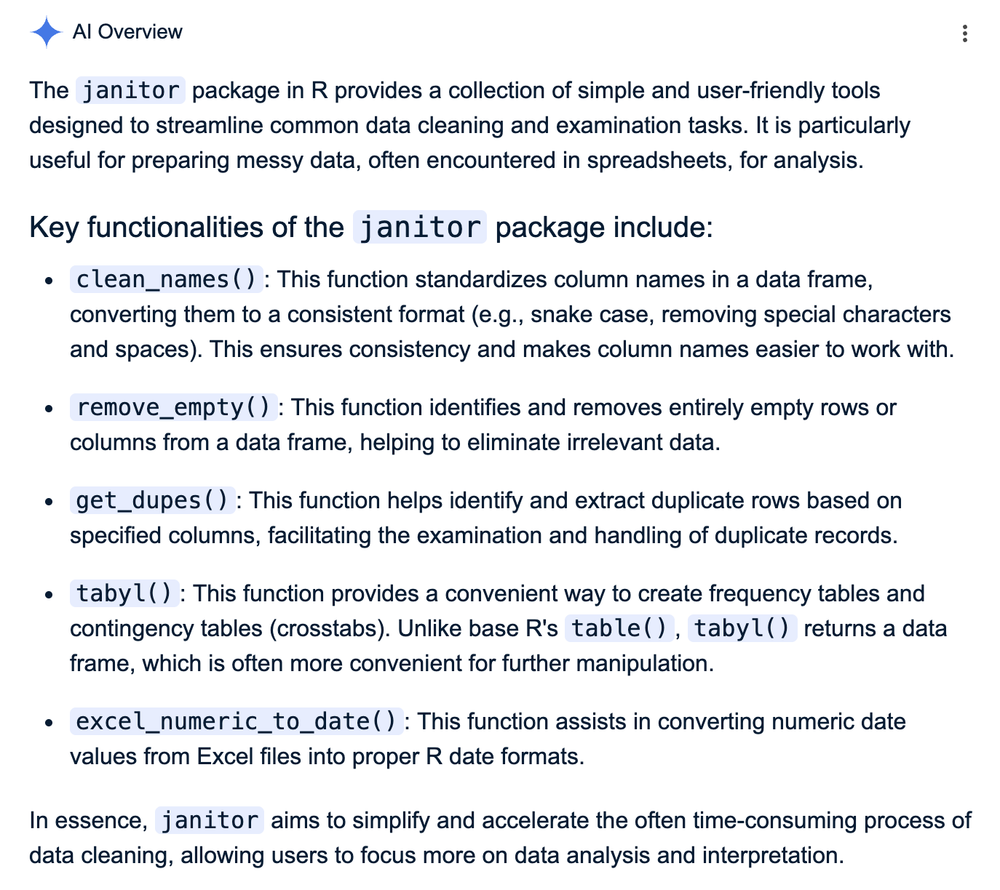
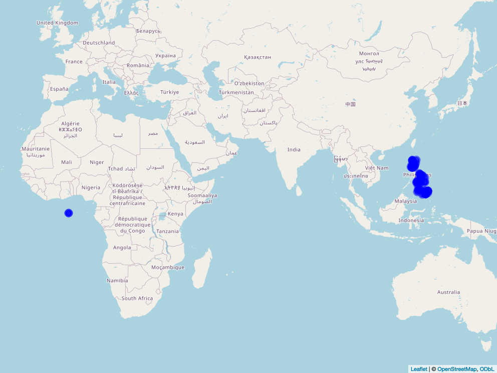

```{r setup, include=FALSE}
knitr::opts_chunk$set(echo = TRUE)
```

# OBJECTIVES

Think about:

1.  What do you want to do with your data?

2.  What outputs from your data set are you expecting to effectively communicate with your:

-   supervisors
-   colleagues
-   stakeholders?

# GETTING STARTED

To help us think about how to do things in R:

1.  Write down on a piece of paper the different things that you do to your data when you open it in Microsoft Excel (or any similar software);
2.  Is there a way to organize these steps following a logical sequence?
3.  What are the main tasks? Sub tasks?

Outline these main tasks here in the R Markdown as headers. Then insert a chunk of code beneath them, ready for us to explore how to transform the steps in R.

**Reminder:**

1.  **The internet is our friend.** Use Google/ChatGPT to troubleshoot and get some ideas. Do not feel guilty about using them. A lot of programmers who are much better at us on this do that. **BUT** make sure that you are getting the correct outputs and you understand what is going on.

    *(And it becomes a different story when you let them do **all** the work for you.)*

2.  **Document.** Explain what needs to be explained. Use comments. Write brief paragraphs.

# SAMPLE WORKFLOW:

# 1. Libraries

Always start with loading the packages that are needed in your analysis.

```{r}

library(tidyverse)
library(here)         # for filepaths
library(janitor)      # for cleaning column names
library(leaflet)      # for mapping
library(mapview)      # for taking a "screenshot" of the interactive map
library(webshot)
library(sp)

```

# 2. File input

```{r}

ABEMIS <- read_csv(here("00_Data", "ABEMIS_Machinery_Inventory-Oct-06-25.csv"))

```

```{r}

head(ABEMIS)

```

```{r}

str(ABEMIS)

```

```{r}

summary(ABEMIS)

```

# 3. Rename columns so they are R friendly

```{r}

# Assign ABEMIS to a different dataframe so the original is kept intact
ABEMIS_clean <- ABEMIS

```

```{r}

names(ABEMIS_clean)

```

```{r}

# Use stringr to replace all spaces in between column headers as underscore
names(ABEMIS_clean) <- str_replace_all(names(ABEMIS_clean), " ", "_")

names(ABEMIS_clean)
```

# 4. Change date columns into R dates

```{r}

#class(ABEMIS_clean$Date_Turned-over)

```

There seems to be backticks around some column names as what appears when we let R suggest the name of the column:

```{r}

class(ABEMIS_clean$`Date_Turned-over`)

```

We don't want backticks because that breaks R's normal naming rules.

There's an additional package that we can use for that: `janitor`

```{r}

# Remove backticks without needing to check each column if they have backticks
ABEMIS_clean <- clean_names(ABEMIS_clean)

names(ABEMIS_clean)

```

```{r}

# Check if the column we spotted to have backticks still have backticks
ABEMIS_clean$date_turned_over   # no more, yay!

```



```{r}

class(ABEMIS_clean$date_turned_over)

```

With tidyverse, R already read it in date format, which means I don't need to do anything anymore.

# 5. Change character to factors?

# 6. What else...

## Tables and Graphs?

# Some suggestions:

## Maps?

I noticed that you have latitude and longitude in your data set...

```{r}

# Create interactive map
PH_map <- leaflet(ABEMIS_clean) %>%
  addTiles() %>%  # Add default OpenStreetMap tiles
                  # adds a base map
  addCircleMarkers(   # plots each point using your longitude & latitude
    lng = ~longitude,
    lat = ~latitude,
    popup = ~barangay,
    radius = 6,
    color = "blue",
    fillOpacity = 0.7
  )

PH_map

```

Note: Must knit to HTML if we want to keep this map.

Otherwise: Export then add/embed

```{r}

# Import the map
# I'm putting it inside Scripts/images because this is where RMarkdown wants our image files to be coming from

mapshot(PH_map, file = here("01_Scripts", "images", "PH_map.png"))
```



The exported version is off and actually shows questionable latitude/longitude in our data set.

## File Output?

If you need to save a version of your data set that has already undergone changes and analysis.
